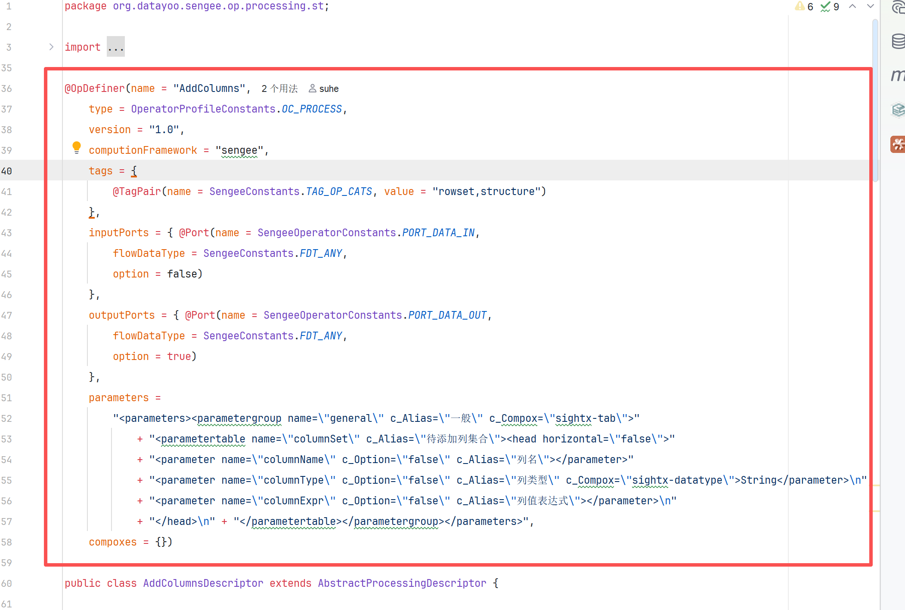
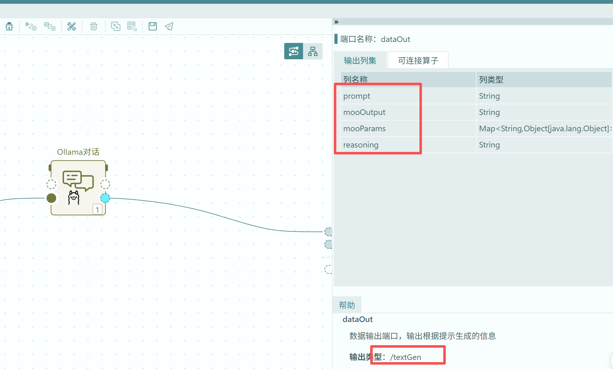
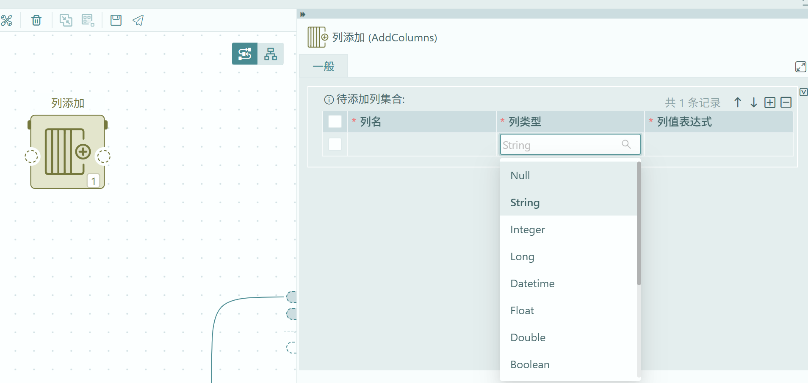
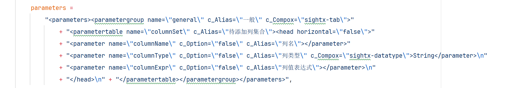

# 02 定义态算子开发

开源示例工程：[Datayoo/datayoo-ops](https://github.com/Datayoo/datayoo-ops)。里面有可对照的 Descriptor / Oyez 写法，也可把仓库或相关文件丢给大模型，按本规范帮你生成骨架代码。

动手前先执行工程里的 **install 脚本**，把平台所需依赖安装到本地 Maven 仓库；否则 descriptor / oyez 工程无法解析私有坐标。

自行创建 Maven 工程，并分别添加 **descriptor**、**oyez** 两个子模块；二者放在**同一个父模块**下管理更合适（版本、依赖、打包都在一处）。开发时先写 descriptor，再写 oyez。
以开源工程中的 **AddColumns** 为例：设计初衷是在数据处理过程中给数据集**添加一列**。

---
## 1. 注解

算子类通过 **`@OpDefiner`** 标明「这是一个算子」。注解各字段的完整说明见 [OpDefiner注解说明](OpDefiner注解说明.md)。下面按 AddColumns 对照读图：

| 项 | 本例取值 | 说明 |
|----|----------|------|
| 算子名 `name` | `AddColumns` | 流程里识别、检索用的名称 |
| 所属类型 `type` | 处理 | 处理类算子 |
| 计算框架 `computionFramework` | `sengee` | 定义态侧框架 |
| 标签 `tags` | 处理 / 集合处理 / 结构化 | 对应 tag：`processing,rowset,structure`（分组规则见 [官方算子分组](官方算子分组.md)） |

**输入端口**

| 项 | 本例 | 说明 |
|----|------|------|
| `name` | `dataIn` | **固定**，实现与连线按此识别；页面上用户改的是端口 **alias**（显示名），不是 `name` |
| `flowDataType` | `any` | 给数据集加列时不限定上游列结构，故不收窄输入类型 |

**输出端口**

| 项 | 本例 | 说明 |
|----|------|------|
| `name` | `dataOut` | 同样 `name` 固定，页面可改 alias |
| `flowDataType` | `any` | 与输入一致，输出仍为任意行集结构 |

**关于 `flowDataType`**

系统里不同的 `flowDataType` 会约束输入/输出的列级结构。若不需要限定，统一用 **`any`** 即可。

**页面参数（可添加多列）**

添加列时往往不止一列，因此参数做成**表格**：每一行定义一列待添加的字段。

| 列（表格字段） | 作用 |
|----------------|------|
| 列名 | 手动输入要新增的列名 |
| 数据类型 | 指定该列的数据类型 |
| 值 | 该列取值的来源 |

「值」一类输入框通常支持三种来源：

| 来源 | 含义 |
|------|------|
| 常量 | 固定字面量 |
| 前置字段 | 引用上游数据中的已有字段 |
| 函数 | 用表达式/函数计算结果 |

控件类型（`c_Compox` 等）的选用见 [OpDefiner注解说明](OpDefiner注解说明.md)；函数写法与能力见 [飞书文档：函数说明](https://datayoo-doc.feishu.cn/wiki/JwKiwuBJWi9XfqkU7fqckoZonZf)。

## 2. 继承

定义态算子类需要**继承平台提供的 Descriptor 基类**。各类算子对应的基类可在开源示例工程里对照；想省事时，可直接继承 **`AbstractOperatorDescriptor`**。

其中几个方法需要重点实现 / 覆盖：

| 方法 | 作用 |
|------|------|
| `readParameters()` | 读取页面配置的参数，落到定义态可使用的结构 |
| `compileCsmOfOutputPort(FlowPort<PlRowSet> flowPort)` | 指定输出端口的**输出列级**（下游靠这份结构继续编排） |
| `validateParameters()` | 校验参数是否合法（必填、类型、相互约束等） |

## 3. 打包

定义态写完后，需要打成平台可导入的 **descriptor zip**。步骤与注意点以开源示例工程说明为准，见：

[Datayoo/datayoo-ops → 算子打包](https://github.com/Datayoo/datayoo-ops#算子打包)

要点回顾：

1. 先 `mvn clean package`（或等价编译），保证模块 `target/*.jar` 已生成  
2. 在 IDEA Maven 面板中，对 **descriptor** 模块执行：`Plugins` → `descriptor-plugin` → **`descriptorPack`**  
3. 生成的 zip 即为定义态导入包；实现态（oyez）见 [03 实现态](03-实现态.md)  
