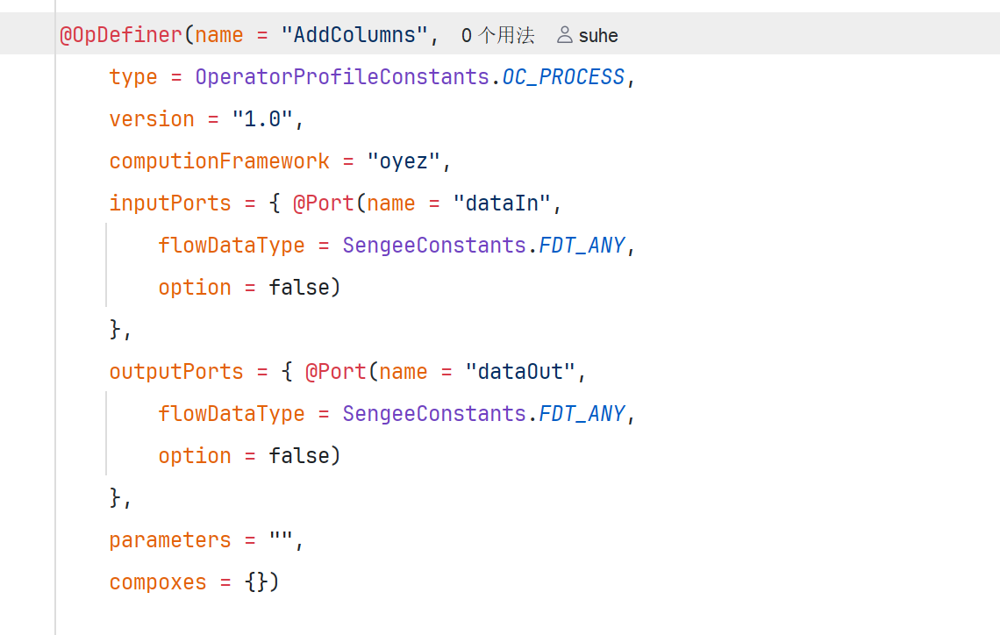

# 03 实现态（Oyez）

定义态（[02 定义态](02-定义态.md)）就绪后，在 **oyez** 模块编写真正的执行逻辑。自研仅开放 **Oyez（单机）** 引擎。开源对照见 [Datayoo/datayoo-ops](https://github.com/Datayoo/datayoo-ops)。

---

## 1. `@OpDefiner`（与定义态对齐）

实现态同样用 **`@OpDefiner`** 标明算子。

| 规则 | 说明 |
|------|------|
| 与 Descriptor **一致** | 名称等关键标识需能对上定义态，平台才能把「配置」和「执行」配成一对 |
| 参数可以不写 | 不写则沿用 Descriptor 侧参数 |
| 写了会**合并** | 实现态声明的参数会与 Descriptor 合并（不同计算框架下参数可能不同） |

字段细则见 [OpDefiner注解说明](OpDefiner注解说明.md)。

---

## 2. 继承与生命周期

实现态可继承的基类有多种，开源示例里按算子类型各有对应。想省事时，可直接继承 **`AbstractOyezOperator`**。

重点不在「有哪些基类」，而在**数据处理生命周期有先后顺序**。在正确的阶段做正确的事；核心处理逻辑通常落在：

| 方法 | 作用 |
|------|------|
| `innerOperate()` | 无列级元数据参与时的处理入口（按基类约定使用） |
| `innerOperate(ColumnSetMetadata columnSetMetadata, int i, Object[] objects)` | 带列级元数据、按行/按批推进时的处理入口 |

生命周期各阶段的先后关系以基类 / 开源示例为准，实现时不要打乱顺序。

---

## 3. 打包

实现态打成可导入的 **oyez zip**。完整说明见开源工程：

[Datayoo/datayoo-ops → 算子打包](https://github.com/Datayoo/datayoo-ops#算子打包)

**务必注意：** 打 oyez 包前，需要先把**父模块（或对应 descriptor）`install` 到本地仓库**。oyez 依赖 descriptor 的 jar；缺包时 `oyezPack` 会失败。

常见顺序：

1. 编译工程（如 `mvn clean package`）  
2. 对父模块或 descriptor 执行 **`mvn install`**（按示例工程说明）  
3. IDEA Maven 面板：oyez 模块 → `Plugins` → `impl-plugin` → **`oyezPack`**  

导入平台时：**先导 descriptor 包，再导 oyez 包**。见 [04 导入与自验](04-导入与自验.md)。
